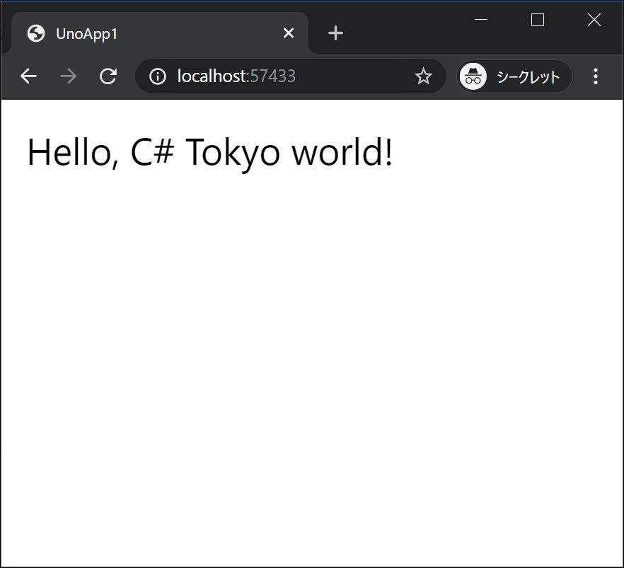
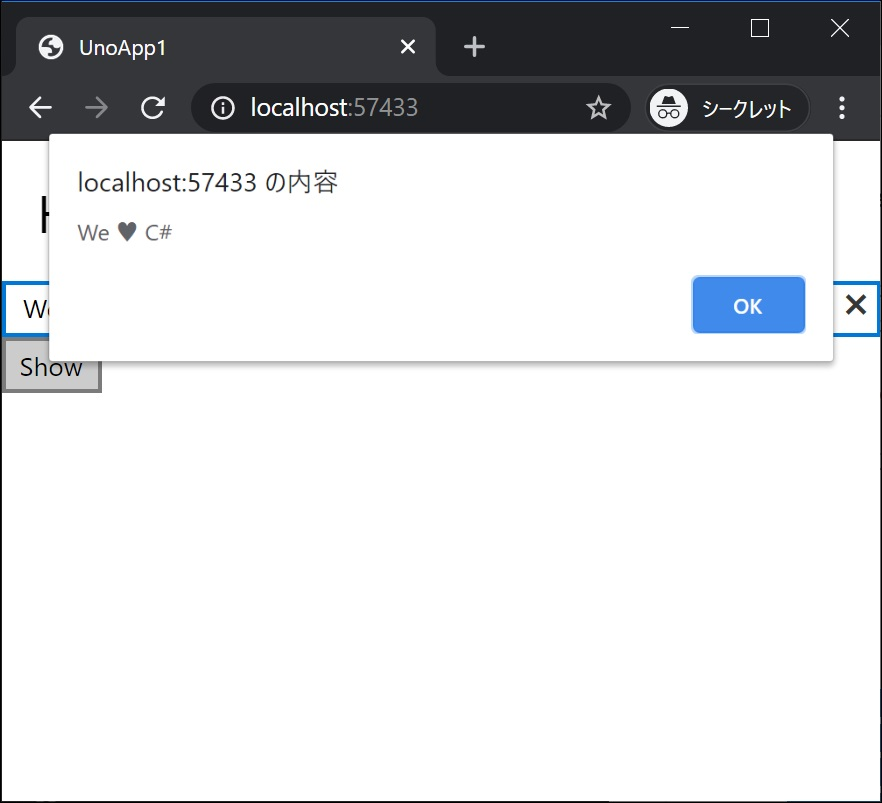

[Top](./top.md)  

# イベント処理と画面更新

コードを変更し、動きのあるアプリにして行きます。

# 画面のテキストを変更

まずは最初から表示されているテキストを変更してみます。

**MainPage.xaml** を開いて TextBlock を次のように編集します。  

```xml
<TextBlock Text="Hello, C# Tokyo world!" Margin="20" FontSize="30" />
```

#### 編集前
```xml
<Page
    x:Class="UnoApp1.MainPage"
    xmlns="http://schemas.microsoft.com/winfx/2006/xaml/presentation"
    xmlns:x="http://schemas.microsoft.com/winfx/2006/xaml"
    xmlns:local="using:UnoApp1"
    xmlns:d="http://schemas.microsoft.com/expression/blend/2008"
    xmlns:mc="http://schemas.openxmlformats.org/markup-compatibility/2006"
    mc:Ignorable="d">

    <Grid Background="{ThemeResource ApplicationPageBackgroundThemeBrush}">
		<TextBlock Text="Hello, world!" Margin="20" FontSize="30" />
    </Grid>
</Page>
```

#### 編集後

```xml
<Page
    x:Class="UnoApp1.MainPage"
    xmlns="http://schemas.microsoft.com/winfx/2006/xaml/presentation"
    xmlns:x="http://schemas.microsoft.com/winfx/2006/xaml"
    xmlns:local="using:UnoApp1"
    xmlns:d="http://schemas.microsoft.com/expression/blend/2008"
    xmlns:mc="http://schemas.openxmlformats.org/markup-compatibility/2006"
    mc:Ignorable="d">

  <Grid Background="{ThemeResource ApplicationPageBackgroundThemeBrush}">
    <TextBlock Text="Hello, C# Tokyo world!" Margin="20" FontSize="30" />
  </Grid>
</Page>
```

## 実行結果

画面のテキストが「**Hello, C# Tokyo world!**」に変わっています。  



# 画面に要素を追加

## StackPanel を画面全体に表示

まず、画面全体に表示する StackPanel を追加します。  

**MainPage.xaml** を開いて編集します。  

#### 編集前
```xml
<Page
    x:Class="UnoApp1.MainPage"
    xmlns="http://schemas.microsoft.com/winfx/2006/xaml/presentation"
    xmlns:x="http://schemas.microsoft.com/winfx/2006/xaml"
    xmlns:local="using:UnoApp1"
    xmlns:d="http://schemas.microsoft.com/expression/blend/2008"
    xmlns:mc="http://schemas.openxmlformats.org/markup-compatibility/2006"
    mc:Ignorable="d">

  <Grid Background="{ThemeResource ApplicationPageBackgroundThemeBrush}">
    <TextBlock Text="Hello, C# Tokyo world!" Margin="20" FontSize="30" />
  </Grid>
</Page>
```

#### 編集後

```xml
<Page
    x:Class="UnoApp1.MainPage"
    xmlns="http://schemas.microsoft.com/winfx/2006/xaml/presentation"
    xmlns:x="http://schemas.microsoft.com/winfx/2006/xaml"
    xmlns:local="using:UnoApp1"
    xmlns:d="http://schemas.microsoft.com/expression/blend/2008"
    xmlns:mc="http://schemas.openxmlformats.org/markup-compatibility/2006"
    mc:Ignorable="d">

  <Grid Background="{ThemeResource ApplicationPageBackgroundThemeBrush}">
    <StackPanel>
      <TextBlock Text="Hello, C# Tokyo world!" Margin="20" FontSize="30" />
    <StackPanel>
  </Grid>
</Page>
```

**StackPanel** はその子供の要素を一列に並べます。  
今はまだ何も変わりませんが、今後 **StackPanel** の中に要素を追加することで、縦一列に要素が表示されます。

## Button を置いてクリック時の処理を作る
ボタンクリック時の動きを作るコードの書き方は複数ありますが、まずはコード量の少ない方法から始めます。  

今回は **TextBox** を 1 つと **Button** 1 つを画面に追加し、ボタンのクリックで **TextBox** の文字列をポップアップメッセージダイアログ表示するようにします。  
画面の **TextBlock** の下に次の 2 つの要素を追加します。

```xml
<TextBox x:Name="textbox1"/>
<Button x:Name="button1" Content="Show" Click="button1_Click"/>
```

**TextBox** に **x:Name** で textbox1 と名前をつけています。これによりプログラムコードの中から textbox1 という名前でこの **TextBox** を操作できます。  
また、**Button** には **Click** に button1_Click とイベントハンドラを設定しています。この名前のメソッドを用意することで、ボタンのクリック時に該当のメソッドが実行されます。

**MainPage.xaml** 全体は次のようになります。

```xml
<Page
    x:Class="UnoApp1.MainPage"
    xmlns="http://schemas.microsoft.com/winfx/2006/xaml/presentation"
    xmlns:x="http://schemas.microsoft.com/winfx/2006/xaml"
    xmlns:local="using:UnoApp1"
    xmlns:d="http://schemas.microsoft.com/expression/blend/2008"
    xmlns:mc="http://schemas.openxmlformats.org/markup-compatibility/2006"
    mc:Ignorable="d">

  <Grid Background="{ThemeResource ApplicationPageBackgroundThemeBrush}">
    <StackPanel>
      <TextBlock Text="Hello, C# Tokyo world!" Margin="20" FontSize="30" />

      <TextBox x:Name="textbox1"/>
      <Button x:Name="button1" Content="Show" Click="button1_Click"/>

    <StackPanel>
  </Grid>
</Page>
```
ボタンクリック時のメソッドを **MainPage.xaml.cs** に追加します。

```cs
private void Button1_Click(object sender, RoutedEventArgs e)
{
    await new MessageDialog(textbox1.Text).ShowAsync();
}
```

**MainPage.xaml.cs** 全体は次のようになります。

```cs
using Windows.UI.Xaml;
using Windows.UI.Xaml.Controls;

namespace UnoApp1
{
    public sealed partial class MainPage : Page
    {
        public MainPage()
        {
            this.InitializeComponent();
        }

        private void Button1_Click(object sender, RoutedEventArgs e)
        {
            await new MessageDialog(textbox1.Text).ShowAsync();
        }
    }
}
```

## 実行結果




ボタンをクリックすると、**TextBox** の値がポップアップメッセージダイアログ表示されます。  

[< | 前へ](./textbook2.md) | [次へ | >](./textbook4.md)
