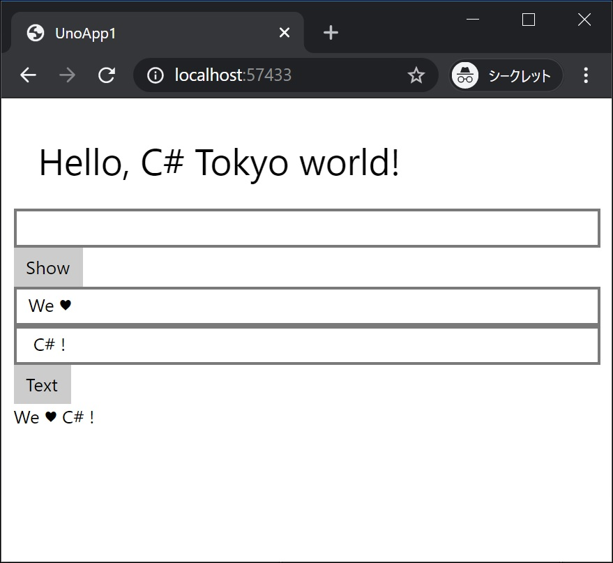

[Top](./top.md)  

# データバインディング

このページでは皆さん大好き、DataBinding をしていきます。

# Data を Binding する画面要素を追加

## Text 要素と Button 要素を追加

DataBinding 用に画面に要素を追加します。

```xml
<TextBox Text="{Binding FirstText}"/>
<TextBox Text="{Binding SecondText}"/>
<Button Content="Text" Command="{Binding TextCommand}"/>
<TextBlock Text="{Binding Text}"/>
```

**MainPage.xaml** 全体は次のようになります。

```xml
<Page
    x:Class="UnoApp1.MainPage"
    xmlns="http://schemas.microsoft.com/winfx/2006/xaml/presentation"
    xmlns:x="http://schemas.microsoft.com/winfx/2006/xaml"
    xmlns:local="using:UnoApp1"
    xmlns:d="http://schemas.microsoft.com/expression/blend/2008"
    xmlns:mc="http://schemas.openxmlformats.org/markup-compatibility/2006"
    mc:Ignorable="d">

    <Grid Background="{ThemeResource ApplicationPageBackgroundThemeBrush}" Padding="10">
        <StackPanel>
            <TextBlock Text="Hello, C# Tokyo world!" Margin="20" FontSize="30" />

            <TextBox x:Name="textbox1"/>
            <Button x:Name="button1" Content="Show" Click="button1_Click"/>

            <TextBox Text="{Binding FirstText}"/>
            <TextBox Text="{Binding SecondText}"/>
            <Button Content="Text" Command="{Binding TextCommand}"/>
            <TextBlock Text="{Binding Text}"/>
        </StackPanel>
    </Grid>
</Page>
```

## Command クラス、ViewModel クラスを編集

**<プロジェクト名>.Share** プロジェクトに **Command** クラス、**BindableBase** クラスを編集します。  
これらのクラスは本来は自分で新規作成をするものですが、今回は Template のプロジェクト内に作成しておきました。それぞれファイルを開いて編集してください。  

※これらのクラスはライブラリやフレームワークを導入すると最初から相当するものが含まれることがあります。

#### Command クラス
**UnoApp1.Shared** プロジェクトの **Command.cs** を開いて次のように編集してください。

```cs
using System;
using System.Windows.Input;

namespace UnoApp1.Shared
{
    class Command : ICommand
    {
        public event EventHandler CanExecuteChanged;

        public Action<object> Action { get; set; }

        public bool CanExecute(object parameter) => true;

        public void Execute(object parameter) => Action?.Invoke(parameter);
    }
}
```
#### BindableBase クラス
**UnoApp1.Shared** プロジェクトの **BindableBase.cs** を開いて次のように編集してください。

```cs
using System;
using System.ComponentModel;
using System.Runtime.CompilerServices;

namespace UnoApp1.Shared
{
    class BindableBase : INotifyPropertyChanged
    {
        public event PropertyChangedEventHandler PropertyChanged;

        protected bool SetProperty<T>(ref T property, T value, [CallerMemberName] string propertyName = null)
        {
            if (Object.Equals(property, value)) return false;
            property = value;
            PropertyChanged?.Invoke(this, new PropertyChangedEventArgs(propertyName));
            return true;
        }
    }
}
```

#### ViewModel クラスを編集
続いてページと対になる ViewModel クラスです。  
こちらも、ファイルは作成済みなので **MainPageViewModel.cs** ファイルを開いて次のように編集してください。

```cs
using System.Collections.Generic;
using System.Net.Http;
using System.Text.Json;
using System.Windows.Input;

namespace UnoApp1.Shared
{
    class MainPageViewModel : BindableBase
    {
        private string _firstText;
        private string _secondText;
        private string _text;
     
        public string FirstText { get => _firstText; set => SetProperty(ref _firstText, value); }
        public string SecondText { get => _secondText; set => SetProperty(ref _secondText, value); }
        public string Text { get => _text; set => SetProperty(ref _text, value); }

        public ICommand TextCommand { get; }

        public MainPageViewModel()
        {
            TextCommand = new Command { Action = OnText };
        }

        private void OnText(object parameter) => Text = FirstText + SecondText;
    }
}
```

#### MainPage.xaml.cs の更新

コンストラクタの最後に次のコードを追加します。

```cs
this.DataContext = new MainPageViewModel();
```

**MainPage.xaml.cs** 全体は次のようになります。

```cs
using System;
using UnoApp1.Shared;
using Windows.UI.Popups;
using Windows.UI.Xaml;
using Windows.UI.Xaml.Controls;

namespace UnoApp1
{
    public sealed partial class MainPage : Page
    {
        public MainPage()
        {
            this.InitializeComponent();

            this.DataContext = new MainPageViewModel();
        }

        private async void button1_Click(object sender, RoutedEventArgs e)
        {
            await new MessageDialog(textbox1.Text).ShowAsync();
        }
    }
}
```

## 実行結果

アプリを実行し、今回追加したふたつのテキストボックスに文字を入力してボタンをクリックすると、ふたつの文字を結合したものがテキストブロックに表示されます。



見事！ DataBinding が動作しました！

[< | 前へ](./textbook3.md) | [次へ | >](./textbook5.md)
