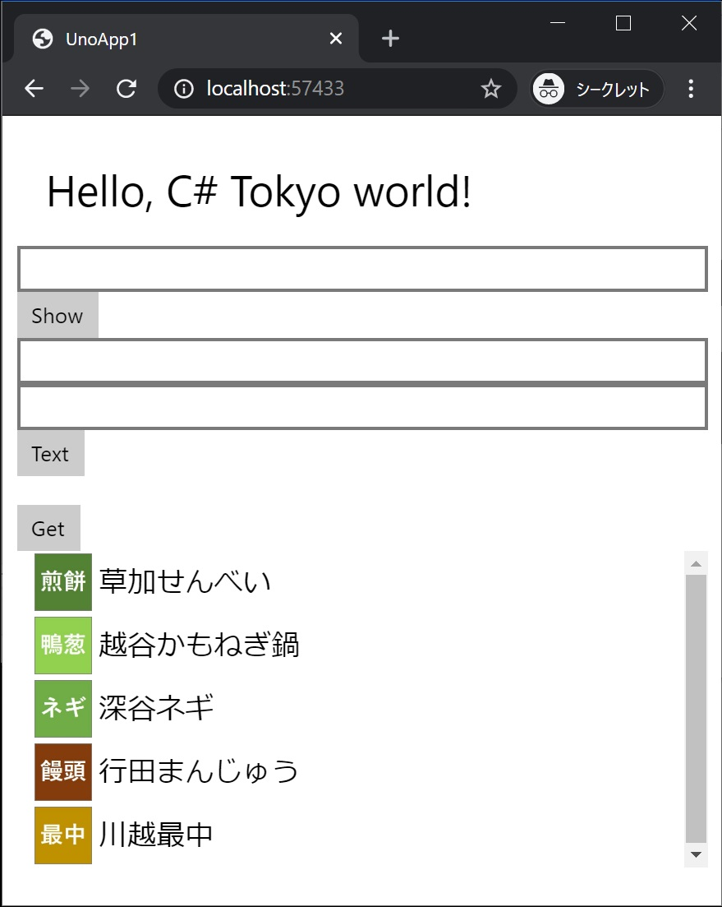

[Top](./top.md)  

# 一覧表示

このページでは Web 上のデータを取得してリスト表示を行います。  

## リスト表示を追加

**MainPage.xaml** にデータ取得する **Button** と一覧表示の **ListView** を追加します。  
ボタンのクリックも一覧の表示データも ViewModel をバンディングしています。

```xml
<Button Content="Get" Command="{Binding GetCommand}"/>

<ListView ItemsSource="{Binding}" DataContext="{Binding Specialties}">
  <ListView.ItemTemplate>
    <DataTemplate>
      <StackPanel Orientation="Horizontal">
        <Image Source="{Binding Image}" Width="40"/>
        <TextBlock Text="{Binding Name}" Margin="5" FontSize="20"/>
      </StackPanel>
    </DataTemplate>
  </ListView.ItemTemplate>
</ListView>
```

**MainPage.xaml** 全体は次のようになります。

```xml
<Page
    x:Class="UnoApp1.MainPage"
    xmlns="http://schemas.microsoft.com/winfx/2006/xaml/presentation"
    xmlns:x="http://schemas.microsoft.com/winfx/2006/xaml"
    xmlns:local="using:UnoApp1"
    xmlns:d="http://schemas.microsoft.com/expression/blend/2008"
    xmlns:mc="http://schemas.openxmlformats.org/markup-compatibility/2006"
    mc:Ignorable="d">

    <Grid Background="{ThemeResource ApplicationPageBackgroundThemeBrush}" Padding="10">
        <StackPanel>
            <TextBlock Text="Hello, C# Tokyo world!" Margin="20" FontSize="30" />

            <TextBox x:Name="textbox1"/>
            <Button x:Name="button1" Content="Show" Click="button1_Click"/>

            <TextBox Text="{Binding FirstText, Mode=TwoWay}"/>
            <TextBox Text="{Binding SecondText, Mode=TwoWay}"/>
            <Button Content="Text" Command="{Binding TextCommand}"/>
            <TextBlock Text="{Binding Text}"/>

            <Button Content="Get" Command="{Binding GetCommand}"/>

            <ListView ItemsSource="{Binding}" DataContext="{Binding Specialties}">
                <ListView.ItemTemplate>
                    <DataTemplate>
                        <StackPanel Orientation="Horizontal">
                            <Image Source="{Binding Image}" Width="40"/>
                            <TextBlock Text="{Binding Name}" Margin="5" FontSize="20"/>
                        </StackPanel>
                    </DataTemplate>
                </ListView.ItemTemplate>
            </ListView>
        </StackPanel>
    </Grid>
</Page>
```

## モデルクラスの追加

一覧表示用のデータは Json 形式のテキストデータになっています。これを Deserialize する際のデータの型となるモデルクラスを追加します。  
今回は、クラス自体は追加済みになっています。**Spetialty.cs** を開いて次のように編集してください。

```cs

namespace UnoApp1.Shared
{
    class Spetialty
    {
        public string Image { get; set; }
        public string Name { get; set; }
        public string Description { get; set; }
    }
}
```

## ViewModel にプロパティやメソッドを追加

**MainPageViewModel.cs** にリストに表示するデータを保持するプロパティとバッキングフィールドを追加します。

```cs
public IEnumerable<Spetialty> Specialties { get => _specialties; set => SetProperty(ref _specialties, value); }
```
```cs
private IEnumerable<Spetialty> _specialties;
```

続けてボタンクリック時の **Command** を追加します。

```cs
public ICommand GetCommand { get; }
```

**Command** を追加したので、**MainPageViewModel** のコンストラクタで **Command** の実体をセットします。

```cs
GetCommand = new Command { Action = OnGet };
```

**Command** で行われる処理 (ボタンクリック時の処理) を行うメソッドを追加します。

```cs
private async void OnGet(object parameter) => Specialties = JsonSerializer.Deserialize<Spetialty[]>
    (
        await _httpClient.GetStringAsync
        (
            "https://raw.githubusercontent.com/m-ishizaki/UnoPlatformHelloWorldShort/master/src/api/saitamas.json"
        )
    );
```

メソッド内で ``_httpClient`` という名前で **HttpClient** クラスを使用しているので、フィールドを追加します。

```cs
private static readonly HttpClient _httpClient = new HttpClient();
```

**MainPageViewModel.xaml.cs** 全体は次のようになります。

```cs
using System;
using System.Collections.Generic;
using System.Net.Http;
using System.Text.Json;
using System.Windows.Input;

namespace UnoApp1.Shared
{
    class MainPageViewModel : BindableBase
    {
        private static readonly HttpClient _httpClient = new HttpClient();

        private string _firstText;
        private string _secondText;
        private string _text;
        private IEnumerable<Spetialty> _specialties;

        public string FirstText { get => _firstText; set => SetProperty(ref _firstText, value); }
        public string SecondText { get => _secondText; set => SetProperty(ref _secondText, value); }
        public string Text { get => _text; set => SetProperty(ref _text, value); }
        public IEnumerable<Spetialty> Specialties { get => _specialties; set => SetProperty(ref _specialties, value); }

        public ICommand TextCommand { get; }
        public ICommand GetCommand { get; }

        public MainPageViewModel()
        {
            TextCommand = new Command { Action = OnText };
            GetCommand = new Command { Action = OnGet };
        }

        private void OnText(object parameter) => Text = FirstText + SecondText;
        private async void OnGet(object parameter) => Specialties = JsonSerializer.Deserialize<Spetialty[]>
            (
                await _httpClient.GetStringAsync
                (
                    "https://raw.githubusercontent.com/m-ishizaki/UnoPlatformHelloWorldShort/master/src/api/saitamas.json"
                )
            );
    }
}
```

## 実行結果



埼玉の名産が一覧表示されます！

[< | 前へ](./textbook4.md) | [次へ | >](./textbook6.md)
