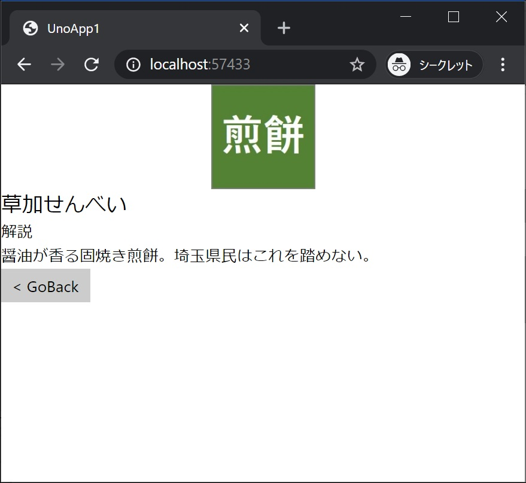

[Top](./top.md)  

# 画面遷移

一覧選択時に画面遷移するコードを書いていきます。

# 最初の画面に一覧選択イベントを追加

**MainPage.xaml** に **ListView** で要素クリック(タップ)時の処理を行えるイベントハンドラの設定を追加します。

```xml
ItemClick="listView_ItemClick" IsItemClickEnabled="true" SelectionMode="None"
```

イベントハンドラの設定を追加した **ListView** は次の様になります。

```xml
<ListView ItemsSource="{Binding}" DataContext="{Binding Specialties}"
          ItemClick="listView_ItemClick" IsItemClickEnabled="true" SelectionMode="None">
```

**MainPage.xaml** 全体は次のようになります。

```xml
<Page
    x:Class="UnoApp1.MainPage"
    xmlns="http://schemas.microsoft.com/winfx/2006/xaml/presentation"
    xmlns:x="http://schemas.microsoft.com/winfx/2006/xaml"
    xmlns:local="using:UnoApp1"
    xmlns:d="http://schemas.microsoft.com/expression/blend/2008"
    xmlns:mc="http://schemas.openxmlformats.org/markup-compatibility/2006"
    mc:Ignorable="d">

    <Grid Background="{ThemeResource ApplicationPageBackgroundThemeBrush}" Padding="10">
        <StackPanel>
            <TextBlock Text="Hello, C# Tokyo world!" Margin="20" FontSize="30" />

            <TextBox x:Name="textbox1"/>
            <Button x:Name="button1" Content="Show" Click="button1_Click"/>

            <TextBox Text="{Binding FirstText, Mode=TwoWay}"/>
            <TextBox Text="{Binding SecondText, Mode=TwoWay}"/>
            <Button Content="Text" Command="{Binding TextCommand}"/>
            <TextBlock Text="{Binding Text}"/>

            <TextBlock />

            <Button Content="Get" Command="{Binding GetCommand}"/>

            <ListView ItemsSource="{Binding}" DataContext="{Binding Specialties}"
                      ItemClick="listView_ItemClick" IsItemClickEnabled="true" SelectionMode="None">
                <ListView.ItemTemplate>
                    <DataTemplate>
                        <StackPanel Orientation="Horizontal">
                            <Image Source="{Binding Image}" Width="40"/>
                            <TextBlock Text="{Binding Name}" Margin="5" FontSize="20"/>
                        </StackPanel>
                    </DataTemplate>
                </ListView.ItemTemplate>
            </ListView>
        </StackPanel>
    </Grid>
</Page>
```

# イベント処理で画面遷移のコードを追加

**MainPage.xaml.cs** に一覧で要素がクリック(タップ)された際に画面遷移するコードを追加します。  

```cs
private void listView_ItemClick(object sender, ItemClickEventArgs e)
{
    var value =  e.ClickedItem;

    this.Frame.Navigate(typeof(SecondPage), value);
}
```

画面遷移をしているコードは ```this.Frame.Navigate(typeof(SecondPage), value);``` の部分です。

**MainPage.xaml.cs** 全体は次のようになります。

```cs
using System;
using UnoApp1.Shared;
using Windows.UI.Popups;
using Windows.UI.Xaml;
using Windows.UI.Xaml.Controls;

namespace UnoApp1
{
    public sealed partial class MainPage : Page
    {
        public MainPage()
        {
            this.InitializeComponent();

            this.DataContext = new MainPageViewModel();
        }

        private async void button1_Click(object sender, RoutedEventArgs e)
        {
            await new MessageDialog(textbox1.Text).ShowAsync();
        }

        private void listView_ItemClick(object sender, ItemClickEventArgs e)
        {
            var value = e.ClickedItem as Spetialty;

            this.Frame.Navigate(typeof(SecondPage), value);
        }
    }
}
```

## 実行結果


私は **草加せんべい** を選択！  
一覧で要素をクリック(タップ)すると、画面遷移し遷移先の画面にクリック(タップ)した値が表示されました！

[< | 前へ](./textbook6.md) | [次へ | >](./textbook8.md)
