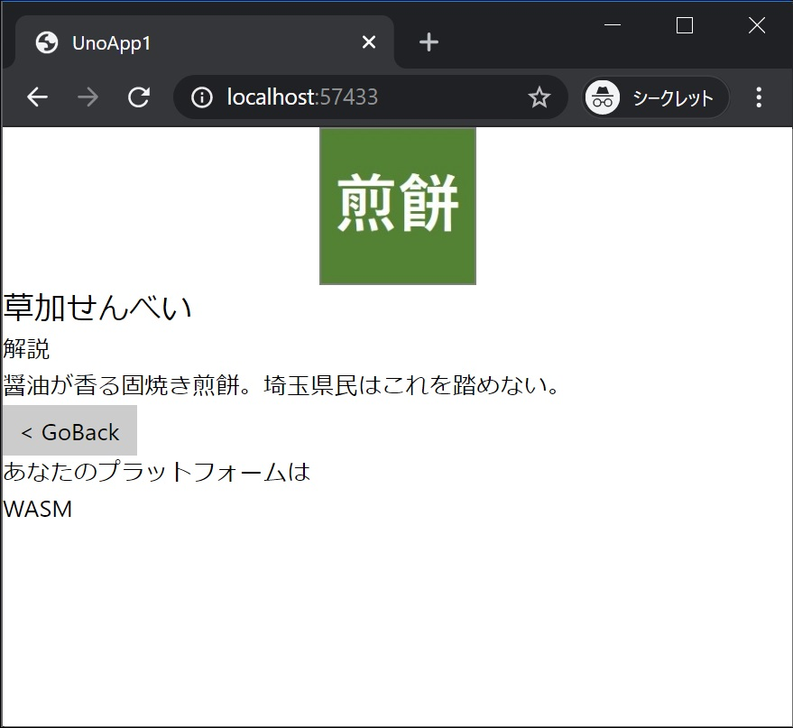

[Top](./top.md)  

# プラットフォーム毎の処理

ここが最後のページです。もうすこしで終わりです、頑張っていきましょう！  

このページではプラットフォーム毎にコードなどを変えてみます。  
プラットフォーム毎に挙動などを変える手段は複数ありますが、このサンプルでは最も汎用性の高い一つを試してみます。

# C# コードをプラットフォーム毎に変える (プリプロセッサディレクティブ)

C# の機能で、```#if XXXXX``` から ```#endif``` で囲まれた範囲が **XXXXX** のプラットフォーム向けのコンパイル時にのみ有効になります。  

**参考**  
https://docs.microsoft.com/ja-jp/dotnet/csharp/language-reference/preprocessor-directives/preprocessor-if

```cs
#if XXXXX

    // プラットフォーム固有の処理

#endif
```

**XXXXX** は Uno Platform のテンプレートでは次の様に設定されています。  

| プラットフォーム | 条件付きコンパイルシンボル |
|:-|:-|
| WebAssembly | \_\_WASM\_\_ |
| UWP | WINDOWS_UWP |
| Android | \_\_ANDROID\_\_ |
| iOS | \_\_IOS\_\_ |

**SecondPage.xaml** にプラットフォーム毎に表示テキストを変える **TextBlock** を画面に追加します。

```xml
<TextBlock Text="あなたのプラットフォームは"/>
<TextBlock x:Name="platform"/>
```

**SecondPage.xaml** 全体は次のようになります。

```xml
<Page
    x:Class="UnoApp1.Shared.SecondPage"
    xmlns="http://schemas.microsoft.com/winfx/2006/xaml/presentation"
    xmlns:x="http://schemas.microsoft.com/winfx/2006/xaml"
    xmlns:local="using:UnoApp1.Shared"
    xmlns:d="http://schemas.microsoft.com/expression/blend/2008"
    xmlns:mc="http://schemas.openxmlformats.org/markup-compatibility/2006"
    mc:Ignorable="d"
    Background="{ThemeResource ApplicationPageBackgroundThemeBrush}">

    <Grid>
        <StackPanel>
            <Image Source="{Binding Image}" Height="100"/>
            <TextBlock Text="{Binding Name}" FontSize="20"/>
            <TextBlock Text="解説"/>
            <TextBlock Text="{Binding Description}"/>
            <Button Content="&lt; GoBack" Click="Button_Click_GoBack"/>
            <TextBlock Text="あなたのプラットフォームは"/>
            <TextBlock x:Name="platform"/>
        </StackPanel>
    </Grid>
</Page>
```

**SecondPage.xaml.cs** にプラットフォーム毎に異なるテキストを設定するコードを追加します。
追加する場所はコンストラクタ ( ```public SecondPage() { ...``` ) の最後です。

```cs
#if __WASM__
            platform.Text = "WASM";
#endif

#if WINDOWS_UWP
           platform.Text = "UWP";
#endif

#if __ANDROID__
            platform.Text = "Android";
#endif

#if __IOS__
           platform.Text = "iOS";
#endif
```

**SecondPage.xaml.cs** 全体は次のようになります。

```cs
using Windows.UI.Xaml;
using Windows.UI.Xaml.Controls;
using Windows.UI.Xaml.Navigation;

namespace UnoApp1.Shared
{
    public sealed partial class SecondPage : Page
    {
        public SecondPage()
        {
            this.InitializeComponent();

#if __WASM__
            platform.Text = "WASM";
#endif

#if WINDOWS_UWP
           platform.Text = "UWP";
#endif

#if __ANDROID__
            platform.Text = "Android";
#endif

#if __IOS__
           platform.Text = "iOS";
#endif
        }

        private void Button_Click_GoBack(object sender, RoutedEventArgs e)
        {
            this.Frame.GoBack();
        }

        protected override void OnNavigatedTo(NavigationEventArgs e)
        {
            this.DataContext = e.Parameter;

            base.OnNavigatedTo(e);
        }
    }
}
```

## 実行結果

画像は WebAssembly (WASM) の例です。  


**計画通り！** プラットフォーム毎に異なる表示がされました。画像は掲載していませんが、Android、iOS でも同様です。

# 良い Uno Platform ライフを！

今回の Hello world はこれで終わりです。基本は押さえられたと思います。是非 Uno Platform でのアプリ開発にチャレンジしてみてください。  
おつかれさまでした。

[< | 前へ](./textbook7.md) | [Topへ | >](./top.md)
